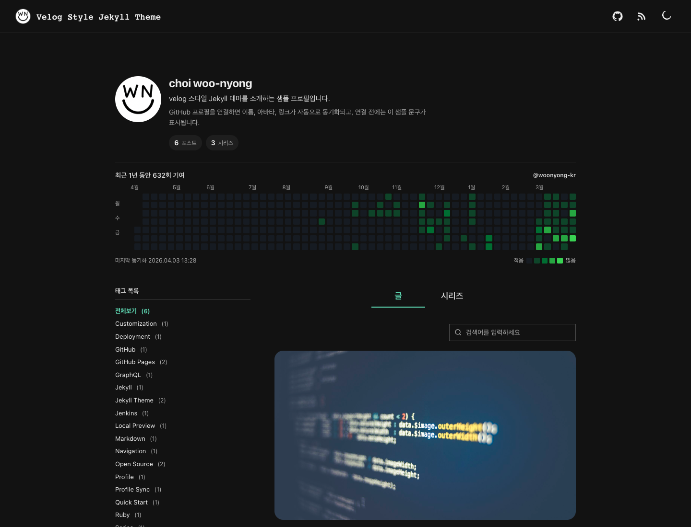

# jekyll-theme-velog

velog 스타일의 읽기 흐름을 좋아하는 개발자를 위해 만든 Jekyll starter theme입니다.  
GitHub Pages 배포, 시리즈 탭, 태그 필터, GitHub 프로필 동기화, 기여 그래프, Giscus/Disqus 댓글, Algolia 검색까지 바로 붙일 수 있게 구성했습니다.

라이브 데모: [https://woonyong-kr.github.io/jekyll-theme-velog/](https://woonyong-kr.github.io/jekyll-theme-velog/)

---

## 미리보기

### 홈


### 시리즈


### 글


---

## 포함된 기능

- 글 목록, 태그 필터, 로컬 검색
- 시리즈 탭과 시리즈별 필터
- 썸네일, 이전 글 / 다음 글 네비게이션
- 라이트 / 다크 모드
- GitHub 프로필 동기화와 1년 기여 그래프
- Giscus 댓글, Disqus 댓글
- Algolia DocSearch 기반 검색
- GitHub Actions, Jenkins 배포 예시
- Jekyll Feed, SEO Tag, Sitemap

---

## GitHub Pages가 처음이신가요?

> GitHub Pages는 GitHub 저장소를 그대로 웹사이트로 호스팅해주는 무료 서비스입니다.  
> 별도 서버 없이 코드를 push하면 자동으로 블로그가 배포됩니다.

**이 테마를 쓰기 위해 필요한 것:**

- GitHub 계정 (없으면 [github.com](https://github.com)에서 무료 가입)
- 이 저장소를 본인 계정으로 fork (아래 안내 참고)

코드를 직접 짤 줄 몰라도 됩니다. 설정 파일 몇 줄만 고치면 나만의 블로그가 만들어집니다.

---

## 빠른 시작 — 5분 안에 내 블로그 배포하기

### 1단계 — 저장소 fork하기

1. 이 페이지 오른쪽 위의 **Fork** 버튼을 클릭합니다.
2. `Owner`는 본인 계정을 선택합니다.
3. **저장소 이름(Repository name)** 을 정합니다.

> **저장소 이름 규칙 — 이게 제일 중요합니다**
>
> | 원하는 주소 | 저장소 이름 | baseurl 설정 |
> |---|---|---|
> | `username.github.io` | `username.github.io` | `""` (빈값) |
> | `username.github.io/my-blog` | `my-blog` | `"/my-blog"` |
>
> `username`은 본인 GitHub 아이디입니다.

4. **Create fork** 버튼을 클릭합니다.

---

### 2단계 — `_config.yml` 수정하기

fork한 저장소에서 `_config.yml` 파일을 클릭하고, 오른쪽 위 연필 아이콘(✏️)으로 직접 편집합니다.

아래 네 줄을 본인 정보로 바꾸세요.

```yml
title: 내 블로그 이름
description: 블로그 한 줄 설명
url: "https://username.github.io"   # username을 내 GitHub 아이디로 변경
baseurl: "/my-blog"                 # 1단계 표를 참고해서 설정
```

수정 후 **Commit changes** 버튼을 눌러 저장합니다.

---

### 3단계 — GitHub Pages 활성화하기

1. fork한 저장소의 **Settings** 탭으로 이동합니다.
2. 왼쪽 메뉴에서 **Pages** 를 클릭합니다.
3. **Source** 를 `Deploy from a branch` 로 선택합니다.
4. **Branch** 를 `gh-pages`, **Folder** 를 `/ (root)` 로 설정합니다.
5. **Save** 를 클릭합니다.

> `gh-pages` 브랜치가 보이지 않는다면, 2단계 커밋 이후 잠깐 기다렸다가 다시 확인해보세요.  
> GitHub Actions가 첫 빌드를 마치면 자동으로 생성됩니다.

---

### 4단계 — 배포 확인

저장소의 **Actions** 탭에서 빌드가 완료되면 `url + baseurl` 주소로 블로그에 접속할 수 있습니다.

처음 빌드는 1~2분 정도 걸립니다.

---

## 처음 수정하는 파일 4개

배포 직후엔 이 4개 파일만 순서대로 수정하면 됩니다.

```text
_config.yml           사이트 URL, 제목, 댓글/검색/분석 설정
_data/profile.yml     프로필 fallback 데이터
_data/theme.yml       헤더, 탭, 홈 화면, 통계 표시 여부
_data/series.yml      시리즈 제목과 설명
```

### `_config.yml`

```yml
title: 내 블로그
description: 블로그 설명
url: "https://username.github.io"
baseurl: "/repo-name"
```

### `_data/profile.yml`

GitHub 프로필 동기화를 아직 붙이지 않았거나 실패했을 때 보여줄 fallback 값입니다.

```yml
display_name: 이름
bio: 한 줄 소개
intro: 추가 정보
avatar: /assets/images/avatar-placeholder.svg
github: https://github.com/your-handle
```

### `_data/theme.yml`

```yml
header:
  show_github_link: true
  show_rss_link: true
  show_theme_toggle: true

home:
  initial_post_count: 12
  search_placeholder: 검색어를 입력하세요

hero:
  github_contributions:
    enabled: true        # GitHub 기여 그래프 사용 여부
    username: your-github-id

profile:
  github_sync:
    enabled: true        # GitHub 프로필 자동 동기화 여부
```

### `_data/series.yml`

```yml
my-series:
  title: 시리즈 표시 이름
  description: 시리즈 설명
```

포스트 front matter에서는 키만 넣으면 됩니다.

```yml
series: my-series
```

---

## 포스트 작성하기

`_posts/` 폴더에 파일을 만들면 글이 등록됩니다.

**파일명 규칙:** `YYYY-MM-DD-제목-영문.md`

예시: `2026-04-09-my-first-post.md`

```md
---
title: 글 제목
description: 카드에 보일 설명
date: 2026-01-01 09:00:00 +0900
updated_at: 2026-01-01 21:00:00 +0900
thumbnail: /assets/images/posts/cover.png
series: my-series
tags:
  - Jekyll
  - GitHub Pages
---

여기에 본문을 마크다운으로 작성합니다.
```

> `date` 가 미래 날짜이면 빌드 시 글이 보이지 않을 수 있습니다. 현재 날짜 이전으로 설정하세요.

---

## 이 저장소 시작 방법 선택하기

| 방법 | 언제 쓰나요? |
|---|---|
| **Use this template** (GitHub 버튼) | 깔끔하게 새로 시작하고 싶을 때 (커밋 히스토리 없이 시작) |
| **Fork** | 이후에 이 테마의 업데이트를 내 블로그에도 반영하고 싶을 때 |

fork로 시작하면 upstream 변경을 직접 merge하거나 별도 sync workflow를 붙여 운영 저장소에 반영할 수 있습니다.

---

## 로컬에서 실행하기

> 글을 올리기 전 미리 보거나, 테마를 직접 수정하고 싶을 때 사용합니다.  
> GitHub 웹에서만 수정할 계획이라면 이 단계는 건너뛰어도 됩니다.

이 저장소는 Ruby `3.2.9` 기준으로 검증했습니다. `.ruby-version` 도 포함되어 있어 `rbenv`, `asdf`, `mise` 같은 버전 매니저를 쓰면 바로 맞출 수 있습니다.

```bash
BUNDLE_FORCE_RUBY_PLATFORM=true bundle install
BUNDLE_FORCE_RUBY_PLATFORM=true bundle exec jekyll doctor
BUNDLE_FORCE_RUBY_PLATFORM=true bundle exec jekyll serve
```

브라우저에서 `http://127.0.0.1:4000/` 으로 접속하면 미리보기가 가능합니다.

GitHub 프로필과 기여 그래프까지 로컬에서 미리 보고 싶다면 아래 스크립트를 한 번 실행합니다.

```bash
ruby scripts/fetch_github_contributions.rb
```

인증은 아래 셋 중 하나면 됩니다.

- `GITHUB_GRAPHQL_TOKEN`
- `GITHUB_TOKEN`
- `gh auth login`

토큰이 없으면 프로필 fallback 데이터가 표시되고, 빌드 자체는 계속됩니다.

---

## 선택 기능

값을 채운 경우에만 활성화됩니다. 기본값은 비워두었습니다.

### GitHub 프로필 동기화와 기여 그래프

`_data/theme.yml` 에서 아래 값을 켭니다.

```yml
hero:
  github_contributions:
    enabled: true
    username: your-github-id

profile:
  github_sync:
    enabled: true
```

배포 환경에서 자동으로 동기화하려면 저장소 `Settings → Secrets and variables → Actions` 에 `GH_PAT` 를 추가합니다. 기본 권한은 `read:user` 면 충분합니다.

---

### Giscus 댓글

1. 저장소가 **public** 이어야 합니다.
2. 저장소 `Settings → Features` 에서 **Discussions** 를 켭니다.
3. [giscus 앱](https://github.com/apps/giscus)을 저장소에 설치합니다.
4. [giscus.app](https://giscus.app/ko) 에서 `repo_id` 와 `category_id` 를 생성합니다.

```yml
# _config.yml
comments:
  provider: "giscus"
  giscus:
    repo: "owner/repository"
    repo_id: "REPOSITORY_NODE_ID"
    category: "Announcements"
    category_id: "CATEGORY_NODE_ID"
    mapping: "pathname"
```

이 테마는 라이트/다크 모드에 맞춰 Giscus에도 velog 느낌의 커스텀 CSS 테마를 적용합니다.

---

### Disqus 댓글

```yml
# _config.yml
comments:
  provider: "disqus"
  disqus:
    shortname: "your-shortname"
```

---

### Algolia 검색

```yml
# _config.yml
search:
  provider: "algolia"
  algolia:
    app_id: "YOUR_APP_ID"
    api_key: "YOUR_SEARCH_API_KEY"
    index_name: "YOUR_INDEX_NAME"
    insights: false
```

값이 비어 있으면 자동으로 로컬 검색 UI만 유지됩니다.

---

### Google Analytics

```yml
# _config.yml
analytics:
  google:
    measurement_id: "G-XXXXXXXXXX"
```

---

## 배포 구조

### GitHub Actions (기본)

`.github/workflows/deploy.yml` 이 포함되어 있어서 `main` 브랜치에 push 하면 자동 배포됩니다.

```text
main push
  → bundle install
  → GitHub 프로필 / 기여 그래프 캐시 생성
  → jekyll build
  → gh-pages 브랜치에 배포
```

기여 그래프 자동 갱신을 위해 매일 새벽 3시 17분에도 스케줄 실행합니다.

**GitHub Pages 설정:**

1. `Settings → Pages`
2. `Source: Deploy from a branch`
3. `Branch: gh-pages`, `Folder: / (root)`
4. Save

---

### 커스텀 도메인과 HTTPS

1. `Settings → Pages` 에서 `Custom domain` 입력
2. DNS에서 CNAME 또는 A 레코드 연결
3. GitHub Pages가 TLS 인증서를 발급할 때까지 대기
4. `Enforce HTTPS` 가 활성화되면 켜기

> 인증서가 늦게 붙을 때는 custom domain을 한 번 제거 후 다시 저장하면 재프로비저닝이 시작되는 경우가 있습니다.

---

### Jenkins

Jenkins 환경에서도 배포할 수 있도록 `Jenkinsfile` 을 포함했습니다.

```text
credentialsId: github-pages
  username: GitHub 사용자명
  password: GitHub Personal Access Token
```

---

## fork 후 체크리스트

배포 직후 이것만 확인하면 대부분의 문제를 예방할 수 있습니다.

- [ ] `_config.yml` 의 `url`, `baseurl`, `title`, `description` 을 바꿨는지
- [ ] `_data/profile.yml` 과 `_data/theme.yml` 이 본인 정보로 바뀌었는지
- [ ] 샘플 포스트와 소개 페이지를 유지할지 교체할지 결정했는지
- [ ] Pages source가 `gh-pages / (root)` 로 지정되어 있는지
- [ ] 커스텀 도메인을 쓴다면 DNS 와 HTTPS 까지 확인했는지
- [ ] 댓글, 검색, 분석처럼 필요한 외부 연동만 켰는지

---

## 트러블슈팅

### 스타일이 깨질 때

`baseurl` 이 저장소 이름과 다르면 CSS, JS, 이미지 경로가 거의 전부 깨집니다.  
가장 먼저 `_config.yml` 의 `baseurl` 을 확인하세요.

```text
저장소 이름이 my-blog            → baseurl: "/my-blog"
저장소 이름이 username.github.io → baseurl: ""
```

---

### Pages는 성공했는데 화면이 비어 있을 때

1. `gh-pages` 브랜치에 실제 빌드 산출물이 올라갔는지 확인
2. GitHub Pages source가 `gh-pages / (root)` 로 맞춰졌는지 확인

---

### gh-pages 브랜치가 안 보일 때

`main` 브랜치에 push 후 GitHub Actions 빌드가 완료되면 자동으로 생성됩니다.  
저장소의 **Actions** 탭에서 빌드 상태를 확인하세요.

---

### HTTPS가 바로 안 붙을 때

DNS가 정상이어도 GitHub Pages TLS 인증서 발급에 시간이 걸릴 수 있습니다.  
`Settings → Pages` 에서 인증서 provisioning 상태를 먼저 확인하세요.

---

### 프로필 동기화가 안 될 때

- `_data/theme.yml` 의 `hero.github_contributions.username` 과 실제 GitHub 계정이 일치하는지 확인
- Actions secret `GH_PAT` 또는 `gh auth login` 이 준비되어 있는지 확인

---

### 로컬에서 bundle install 이 실패할 때

이 저장소는 Ruby `3.2.9` 기준으로 검증했습니다.  
다른 Ruby 버전에서는 네이티브 gem 설치 문제가 생길 수 있으니 `.ruby-version` 에 맞춰 실행하는 편이 안전합니다.

---

## 검증 상태

- 원격 GitHub Actions 배포 성공
- 로컬 `bundle exec jekyll doctor` 통과
- 로컬 `bundle exec jekyll build` 성공
- include / layout 기준으로 미참조 dead code 없음

---

## 라이선스

MIT

포함된 이미지 출처는 [NOTICE.md](NOTICE.md) 에 정리해두었습니다.
